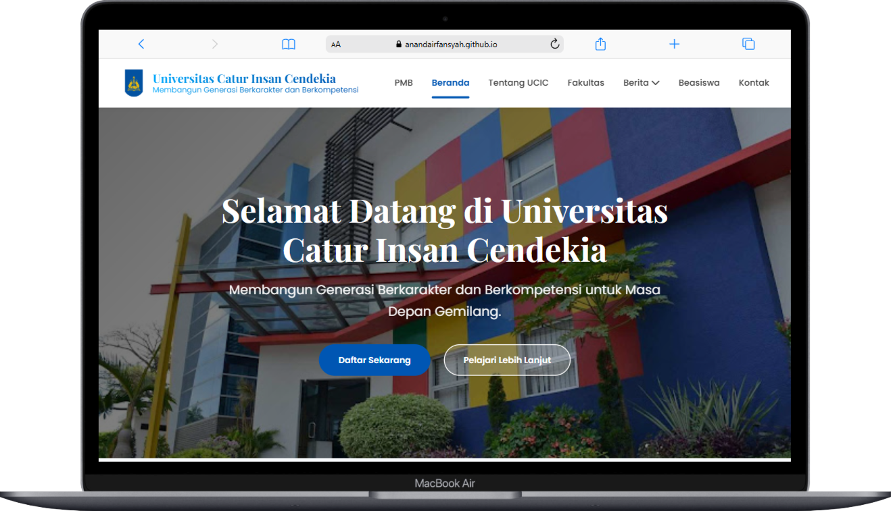
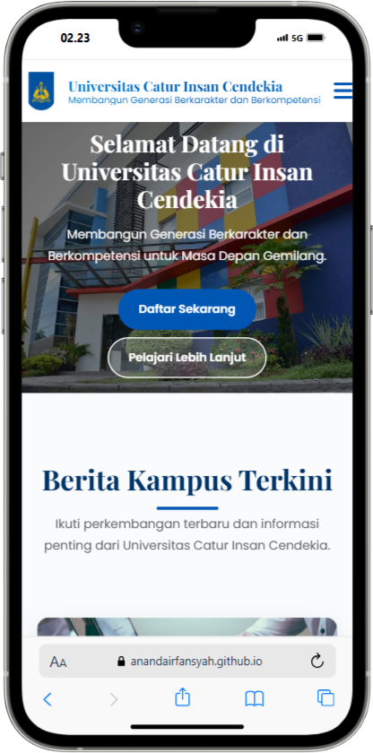

<!-- Banner -->
<p align="center">
  
</p>

<h1 align="center">✨ Redesign Landing Page CIC</h1>

<p align="center">
  <i>Modern & responsive redesign of <a href="https://cic.ac.id" target="_blank">cic.ac.id</a></i>
</p>

<p align="center">
  <a href="https://link-demo.com"></a>
  
  
  
</p>

---

## 🎨 Tentang Project

Redesign landing page **CIC** dibuat untuk menghadirkan:

- 🌐 **Tampilan modern** → desain clean, minimalis, dan elegan
- 📱 **Responsif penuh** → mendukung desktop, tablet, hingga mobile
- 🎯 **Navigasi intuitif** → informasi lebih mudah diakses
- ✨ **Konsistensi UI** → warna & tipografi mengikuti branding CIC

---

## 🚀 Live Demo

🔗 [Klik di sini untuk melihat versi online](https://link-demo.com)

---

## 📦 Struktur Project

WEB DESIGN-UCIC/
├── assets/
│ ├── css/
│ │ └── style.css # File utama untuk styling
│ ├── img/ # Folder untuk gambar
│ └── js/
│ └── script.js # File JavaScript untuk interaksi
├── beasiswa.html # Halaman beasiswa
├── berita-kampus.html # Halaman berita kampus
├── fakultas.html # Halaman fakultas
├── fasilitas.html # Halaman fasilitas
├── index.html # Landing page utama
├── kegiatan.html # Halaman kegiatan
├── kontak.html # Halaman kontak
├── pengumuman.html # Halaman pengumuman kampus
├── tentang-ucic.html # Halaman tentang UCIC
└── README.md # Dokumentasi project

---

## ⚡ Fitur Utama

✅ Desain responsif full device  
✅ Animasi & interaksi halus (CSS & JS opsional)  
✅ Struktur HTML yang rapi & mudah dikembangkan  
✅ Optimasi untuk performa & SEO dasar

---

## 🛠️ Cara Menjalankan

Karena ini adalah project **static HTML**, setup sangat mudah:

```bash
# Clone repository
git clone https://github.com/AnandaIrfansyah/PrimeTech-UCIC-BitFest2025.git

# Masuk folder project
cd PrimeTech-UCIC-BitFest2025

# Jalankan di browser
open index.html   # (MacOS)
start index.html  # (Windows)
```

Atau cukup buka [demo online](https://link-demo.com) 🎉

---

## 📸 Screenshots

<p align="center">
  <table>
    <tr>
      <td align="center" style="border: none;">
        <br/>
        💻 <b>Desktop View</b>
      </td>
      <td align="center" style="border: none;">
        <br/>
        📱 <b>Mobile View</b>
      </td>
    </tr>
  </table>
</p>

---

## 🧩 Teknologi yang Digunakan

- ⚡ **HTML5** → struktur halaman
- 🎨 **CSS3** → styling modern & responsif
- ✨ **JavaScript** → animasi & interaksi tambahan

---

## 👨‍💻 Author

Dibuat dengan ❤️ oleh [Ananda Irfansyah](https://github.com/AnandaIrfansyah) & [Fernando Valentino](https://github.com/Fernando-Valentino)

<p align="center">
  <sub>© 2025 - Redesign CIC Landing Page</sub>
</p>